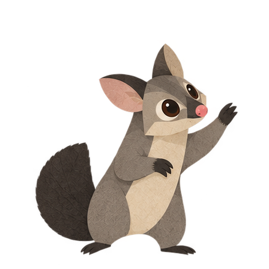
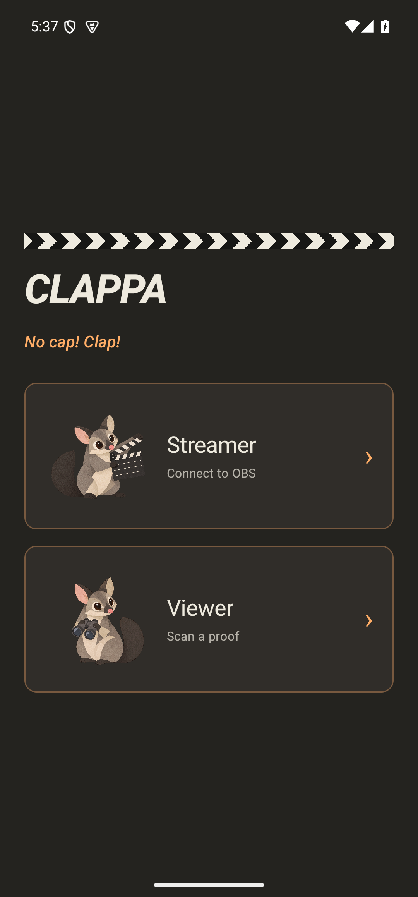

# CLAPPA

### *No cap! Clap!*

CLAPPA pairs an Android phone with OBS. Tap the clapperboard, hear a little musical clack, and answer an unpredictable photo challenge. The pictures appear on stream beside a scannable proof. Viewers can use CLAPPA to check the signed evidence and compare the photos with what they watched happen.

No CLAPPA account. No hosted proof storage. Your signing identity and original evidence stay with you.

**[Download the Test18 preview](https://github.com/dagnabbitdamien/clappa/releases/tag/test18)** · [Build notes](docs/test18.md) · [Developer setup](docs/GITHUB.md)

## For streamers

1. Install the Android APK and native OBS plugin from the release.
2. Open the CLAPPA dock in OBS, add its proof-tile source to your scene, and pair your phone by scanning the dock's code.
3. Start a recording and tap to clap. Your phone guides you through the challenge.
4. Stop recording to seal the original video and its evidence package.

Supported phones use both cameras by default. The phone captures normal and illuminated views; OBS briefly shows the illuminated photo, then the normal photo. Challenge choices, musical notes and illumination are derived from a verified public timing beacon and the preceding OBS media commitment.

## Bring chat along

In the OBS CLAPPA dock, open **Twitch audience challenges**, enter your channel and choose **Connect with Twitch**. Approve read-only chat access in your browser.

**Three different viewers sending 🎬 within 15 seconds buzz the paired phone.** The possum asks whether you want to take a challenge. You can accept or choose **Not now**. There is a two-minute cooldown, and chat never starts your camera or interrupts a challenge already in progress.

Twitch account identity linking on the phone is separate: it adds dated, signed account evidence to your proofs. Chat access credentials are kept in OBS memory only and are never included in proofs.

## For viewers

Choose **Viewer**, scan the animated code on a stream, read the challenge and beacon age, and replay the clapper sound. Public-key details are available when you want them. Then compare the pictures and action with what you see on stream.

The QR carries signed metadata and image hashes—not tiny embedded photographs. Original pictures stay in the local proof folder. Exact recording verification uses the completed original recording and its sealed evidence bundle; a platform-transcoded copy will not have the same byte hash.

## Preview status

This is a **test release for Android and Windows OBS**, not a completed cross-platform product. Automated checks cover signatures, beacon derivation, protocol compatibility and the local capture/transfer/seal workflow. Twitch device-code issuance works with the registered client; complete live account authorization and a live audience trigger have not yet been confirmed. There is no iOS build yet.

CLAPPA binds evidence for human judgment. It is not an automatic AI detector. A sufficiently capable real-time synthesis system can reduce the value of the visual challenge; signatures still protect the integrity of the signed evidence.

## Build and inspect

- [Repository setup](docs/GITHUB.md)
- [Current architecture](docs/CURRENT-ARCHITECTURE.md)
- [Protocol and verification](protocol/README.md)
- [Full design specification](DESIGN_SPEC.md)
- [Latest build notes](docs/test18.md)

Run the protocol/verifier tests with `pnpm install --frozen-lockfile` followed by `pnpm test` (Node.js 22+). Android and OBS require their respective native toolchains. Private keys, local recordings, proof photos and build caches are excluded from this repository.

No project license has been selected. Existing third-party licenses and asset attributions remain applicable; see the relevant vendor and asset directories.

## A peek inside

